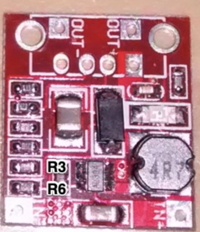

# Small audio amplifier

This is LM386-based power amplifier for radio projects. The simplest possible design directly from the datasheet. 

Assembled mostly from salvaged parts and parts of dubious origin.

# Notes

Instead of a hard-to-get 10k logarithmic volume pot, there is a 100k linear with a 12k resistor from the pot wiper to the ground. This is a nice trick.

The output audio signal jack is wired to disconnect the speaker when something, typically headphones, is inserted.

There is a lipo battery inside, with a TP4056 module. The standard PCB was modified for load sharing i.e. when USB power is available, it powers the amplifier directly, bypassing the battery. A  5V boost module

was modified for ~12V. Output voltage ripple is ~ 50mV. I presume it is much larger under the load, but the audio amplifier load is very jittery and nonstable as well. LM386 is 0.5W max anyway.

# Enclosure

See 3D printed enclosure files [here](enclosure)

The volume potentiometer stem is not shown. I now assemble first and drill all the holes later. This is significantly faster than high-precision measuring and assembly. 

# Assembly

